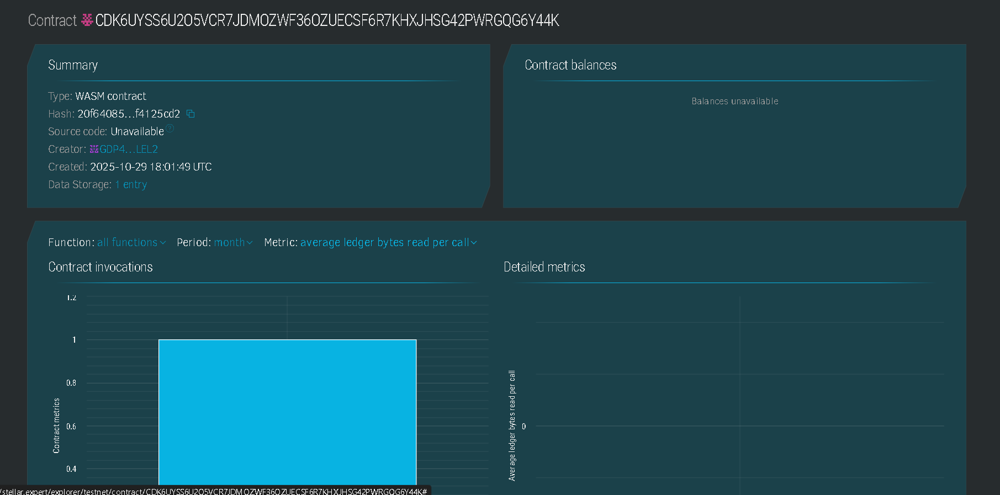

# Decentralized VPN Smart Contract

## Project Title
**Decentralized VPN (dVPN) - Blockchain-Powered Privacy Network**

## Project Description
The Decentralized VPN project is a blockchain-based VPN service built on the Stellar network using Soroban smart contracts. This innovative solution enables node operators to provide bandwidth and VPN services to users while earning token rewards for their contributions. The smart contract manages node registration, bandwidth tracking, token distribution, and network statistics, creating a trustless and transparent ecosystem for decentralized internet privacy.

Unlike traditional centralized VPN services, this dVPN eliminates single points of failure, censorship risks, and privacy concerns by distributing the network across multiple independent node operators who are incentivized through tokenized rewards.

## Contract Details

### Deployed Contract Information
- **Contract Address**: `CDKGUYSS6U2O5VCR7JDMQZWF36OZUECSF6R7KHXJHSG42PWRGQG6Y44K`
- **Network**: Stellar Testnet
- **Contract Type**: WASM (WebAssembly) Smart Contract
- **Contract Hash**: `20f64085...f4125cd2`
- **Creator Address**: `GDP4...LEL2`
- **Deployment Date**: October 29, 2025, 18:01:49 UTC
- **Storage Entries**: 1 entry
- **Source Code**: Available in this repository

### Contract Functions
1. **`register_node(operator: Address)`**
   - Registers a new VPN node operator
   - Parameters: operator address
   - Returns: Success confirmation
   - Authorization: Required from operator

2. **`report_bandwidth_and_reward(operator: Address, bandwidth_gb: u64)`**
   - Reports bandwidth provided and distributes token rewards
   - Parameters: operator address, bandwidth in GB
   - Reward Rate: 10 tokens per GB
   - Authorization: Required from operator

3. **`deactivate_node(operator: Address)`**
   - Deactivates a node operator from the network
   - Parameters: operator address
   - Authorization: Required from operator

4. **`view_network_stats()`**
   - View-only function to retrieve network statistics
   - Returns: NetworkStats struct with total nodes, active nodes, bandwidth, and tokens distributed
   - Authorization: None required (read-only)

5. **`view_node_details(operator: Address)`**
   - View-only function to retrieve specific node information
   - Parameters: operator address
   - Returns: NodeOperator struct with all operator details
   - Authorization: None required (read-only)

## Project Vision
Our vision is to create a truly decentralized, censorship-resistant VPN network that empowers individuals with privacy and freedom while rewarding node operators for their contributions. We aim to:

- **Democratize Internet Privacy**: Make VPN services accessible to everyone through a decentralized infrastructure that cannot be controlled or shut down by any single entity.

- **Incentivize Network Growth**: Create a sustainable economic model where node operators are fairly compensated for providing bandwidth and maintaining network infrastructure.

- **Build Trust Through Transparency**: Utilize blockchain technology to ensure transparent tracking of bandwidth contributions, token rewards, and network performance metrics.

- **Foster Global Connectivity**: Enable a worldwide network of VPN nodes that provides users with diverse geographic options and enhanced privacy protection.

- **Promote Web3 Adoption**: Demonstrate the practical utility of blockchain technology in solving real-world problems related to internet freedom and privacy.

## Key Features

### 1. **Decentralized Node Registration**
- **Open Registration**: Anyone can become a node operator without central approval
- **Unique Identity**: Address-based identification ensures no duplicate registrations
- **Instant Activation**: Nodes become active immediately upon registration
- **Initial Reputation**: Every new node starts with a reputation score of 100
- **Transparent Tracking**: All registrations recorded on-chain with immutable timestamps

### 2. **Automated Token Reward System**
- **Performance-Based Rewards**: Earn 10 tokens for every GB of bandwidth provided
- **Real-Time Distribution**: Tokens credited immediately upon bandwidth reporting
- **Cumulative Earnings**: Track total tokens earned throughout node lifetime
- **Fair & Transparent**: Reward algorithm is open-source and auditable
- **No Middlemen**: Direct peer-to-peer token distribution via smart contract

### 3. **Bandwidth Tracking & Verification**
- **Granular Measurement**: Bandwidth tracked in gigabytes (GB)
- **Cumulative Recording**: Total bandwidth contribution recorded for each node
- **On-Chain Verification**: All bandwidth reports immutably stored on blockchain
- **Network Aggregation**: Total network bandwidth visible to all participants
- **Historical Data**: Complete audit trail of bandwidth contributions

### 4. **Network Statistics Dashboard**
- **Total Nodes**: Real-time count of all registered operators
- **Active Nodes**: Current number of operational nodes
- **Total Bandwidth**: Aggregate bandwidth provided across the network
- **Token Distribution**: Total tokens distributed to all operators
- **Public Access**: Statistics viewable by anyone without authentication
- **Live Updates**: Metrics automatically updated with each transaction

### 5. **Node Management & Control**
- **Self-Service Activation/Deactivation**: Operators control their node status
- **Reputation System**: Quality scoring mechanism for node reliability
- **Status Monitoring**: Track individual node performance and uptime
- **Flexible Operations**: Pause and resume operations without losing data
- **Operator Autonomy**: Full control over node configuration and participation

### 6. **Security & Trust**
- **Authentication Required**: All state-changing operations require cryptographic signatures
- **Address-Based Access Control**: Only authorized operators can modify their data
- **Immutable Records**: Blockchain ensures tamper-proof transaction history
- **Decentralized Trust**: No single entity controls the network
- **Smart Contract Security**: Built with Soroban's secure runtime environment
- **Data Persistence**: Automatic TTL extension ensures long-term data availability

### 7. **Blockchain Integration**
- **Stellar Network**: Built on fast, low-cost Stellar blockchain
- **Soroban Smart Contracts**: Leverages next-generation smart contract platform
- **Cross-Platform Compatibility**: Accessible from any Stellar-compatible wallet
- **Low Transaction Fees**: Minimal costs for all contract interactions
- **Fast Finality**: Near-instant transaction confirmation

## Future Scope

### Phase 1: Core Enhancements (0-6 months)

#### Token Economics & Rewards
- **Dynamic Reward Algorithm**: Implement variable token rates based on:
  - Network demand and supply
  - Geographic location of nodes
  - Time-of-day pricing
  - Bandwidth quality metrics (latency, jitter, packet loss)
- **Staking Mechanism**: Require operators to stake tokens for registration
- **Slashing Conditions**: Penalize nodes for poor performance or malicious behavior
- **Bonus Multipliers**: Extra rewards for high-reputation nodes
- **Referral Program**: Token rewards for bringing new operators to the network

#### User-Side Features
- **User Subscription System**: Enable users to purchase VPN access with tokens
- **Pay-Per-Use Model**: Flexible pricing based on actual bandwidth consumption
- **User Wallet Integration**: Connect popular Stellar wallets for easy payments
- **Service Level Agreements (SLAs)**: Guaranteed uptime and performance tiers
- **User Ratings**: Allow users to rate their VPN experience with specific nodes

#### Quality & Performance
- **Quality of Service (QoS) Tracking**: Monitor and record:
  - Connection latency
  - Uptime percentage
  - Connection stability
  - Data transfer speeds
- **Automated Performance Verification**: Off-chain oracles for real-time node testing
- **Performance-Based Rewards**: Higher rewards for nodes with better QoS
- **Node Health Checks**: Periodic automated testing of all active nodes

### Phase 2: Network Expansion (6-12 months)

#### Advanced Features
- **Geographic Distribution Incentives**:
  - Bonus tokens for operators in underserved regions
  - Coverage maps showing node distribution
  - Auto-routing to nearest optimal nodes
- **Multi-Tier Node System**:
  - Entry Nodes: First connection point
  - Relay Nodes: Traffic routing
  - Exit Nodes: Internet gateway
  - Bridge Nodes: Censorship circumvention
  - Each tier with different reward structures

#### Marketplace & Trading
- **Bandwidth Marketplace**:
  - Users bid for specific bandwidth allocations
  - Operators set their own pricing
  - Automated matching of supply and demand
- **Bandwidth NFTs**: Tokenize bandwidth as tradeable NFT assets
- **Secondary Market**: Trade bandwidth credits between users

#### Governance & Community
- **Governance Token**: Issue governance tokens to stakeholders
- **DAO Formation**: Decentralized Autonomous Organization for protocol decisions
- **Voting Mechanisms**:
  - Protocol parameter changes
  - Reward rate adjustments
  - Feature prioritization
- **Treasury Management**: Community-controlled development fund

### Phase 3: Ecosystem Growth (12-24 months)

#### Privacy & Security Enhancements
- **Zero-Knowledge Proofs**: Enhanced privacy for user connections
- **Multi-Hop Routing**: Onion-routing style architecture for anonymity
- **Encrypted Metadata**: Protect connection metadata
- **No-Log Policy Verification**: Cryptographic proof of no-logging
- **Quantum-Resistant Encryption**: Future-proof cryptographic algorithms

#### Platform Expansion
- **Cross-Chain Bridge**:
  - Support for Ethereum, Polygon, BSC tokens
  - Wrapped token mechanisms
  - Multi-chain operator registration
- **Mobile Applications**:
  - iOS and Android native apps
  - One-click VPN connection
  - Token wallet integration
- **Desktop Applications**:
  - Windows, macOS, Linux clients
  - System tray integration
  - Auto-connect features
- **Browser Extensions**:
  - Chrome, Firefox, Brave extensions
  - Quick node switching
  - Built-in token management

#### Enterprise Solutions
- **Corporate VPN Packages**:
  - Dedicated node allocations
  - Custom SLAs
  - Priority support
  - Volume discounts
- **White-Label Solutions**: Allow businesses to brand their own dVPN service
- **API Access**: RESTful APIs for third-party integrations
- **Analytics Dashboard**: Comprehensive usage statistics and reporting

### Phase 4: Innovation & Research (24+ months)

#### Advanced Technologies
- **AI-Powered Traffic Routing**:
  - Machine learning for optimal node selection
  - Predictive bandwidth allocation
  - Anomaly detection for security
- **Mesh Network Integration**:
  - Peer-to-peer direct connections
  - Reduced reliance on exit nodes
  - Improved resilience
- **Decentralized DNS**: Censorship-resistant domain resolution
- **IPFS Integration**: Decentralized content delivery

#### Sustainability & Social Impact
- **Green Computing Rewards**:
  - Bonus tokens for renewable energy-powered nodes
  - Carbon offset tracking
  - Sustainability scoring
- **Internet Freedom Fund**:
  - Support activists and journalists
  - Provide free VPN access in restricted regions
  - Educational programs
- **Academic Partnerships**: Research collaboration on privacy technologies

#### DeFi Integration
- **Liquidity Pools**: Stake tokens to earn yield
- **Yield Farming**: Provide liquidity for trading pairs
- **Lending/Borrowing**: Use tokens as collateral
- **Token Burning**: Deflationary mechanisms for long-term value

#### Regulatory & Compliance
- **Compliance Framework**:
  - Tools for jurisdiction-specific operations
  - KYC/AML integration for regulated markets
  - Data residency options
- **Legal Defense Fund**: Support operators facing legal challenges
- **Policy Advocacy**: Engage with regulators and lawmakers

---

## Technical Architecture

### Smart Contract Structure
```
DecentralizedVPNContract
├── NodeOperator Struct
│   ├── operator_addr: Address
│   ├── bandwidth_provided: u64
│   ├── tokens_earned: u64
│   ├── is_active: bool
│   └── reputation_score: u64
├── NetworkStats Struct
│   ├── total_nodes: u64
│   ├── active_nodes: u64
│   ├── total_bandwidth: u64
│   └── total_tokens_distributed: u64
└── Functions
    ├── register_node()
    ├── report_bandwidth_and_reward()
    ├── deactivate_node()
    ├── view_network_stats()
    └── view_node_details()
```

### Storage Model
- **Instance Storage**: Persistent data with TTL management
- **Key-Value Structure**: Efficient address-based lookups
- **Automatic Expiration**: 5000 ledgers TTL (extendable)

---

## Getting Started

### Prerequisites
```bash
# Install Rust
curl --proto '=https' --tlsv1.2 -sSf https://sh.rustup.rs | sh

# Install Soroban CLI
cargo install --locked soroban-cli

# Install Stellar CLI
cargo install --locked stellar-cli
```

### Building the Contract
```bash
# Clone the repository
git clone https://github.com/yourusername/decentralized-vpn
cd decentralized-vpn

# Build for WASM target
cargo build --target wasm32-unknown-unknown --release

# Optimize WASM binary
soroban contract optimize \
  --wasm target/wasm32-unknown-unknown/release/dvpn_contract.wasm
```

### Deploying to Testnet
```bash
# Deploy contract
soroban contract deploy \
  --wasm target/wasm32-unknown-unknown/release/dvpn_contract.wasm \
  --source YOUR_SECRET_KEY \
  --network testnet
```

### Interacting with the Contract

#### Register as a Node Operator
```bash
soroban contract invoke \
  --id CDKGUYSS6U2O5VCR7JDMQZWF36OZUECSF6R7KHXJHSG42PWRGQG6Y44K \
  --source YOUR_SECRET_KEY \
  --network testnet \
  -- register_node \
  --operator YOUR_ADDRESS
```

#### Report Bandwidth (Example: 50 GB)
```bash
soroban contract invoke \
  --id CDKGUYSS6U2O5VCR7JDMQZWF36OZUECSF6R7KHXJHSG42PWRGQG6Y44K \
  --source YOUR_SECRET_KEY \
  --network testnet \
  -- report_bandwidth_and_reward \
  --operator YOUR_ADDRESS \
  --bandwidth_gb 50
```

#### View Network Statistics
```bash
soroban contract invoke \
  --id CDKGUYSS6U2O5VCR7JDMQZWF36OZUECSF6R7KHXJHSG42PWRGQG6Y44K \
  --network testnet \
  -- view_network_stats
```

#### View Your Node Details
```bash
soroban contract invoke \
  --id CDKGUYSS6U2O5VCR7JDMQZWF36OZUECSF6R7KHXJHSG42PWRGQG6Y44K \
  --network testnet \
  -- view_node_details \
  --operator YOUR_ADDRESS
```

#### Deactivate Your Node
```bash
soroban contract invoke \
  --id CDKGUYSS6U2O5VCR7JDMQZWF36OZUECSF6R7KHXJHSG42PWRGQG6Y44K \
  --source YOUR_SECRET_KEY \
  --network testnet \
  -- deactivate_node \
  --operator YOUR_ADDRESS
```

---

## Testing

### Run Unit Tests
```bash
cargo test
```

### Run Integration Tests
```bash
cargo test --test integration_tests
```

---

## Economic Model

### Token Rewards Calculation
```
Tokens Earned = Bandwidth Provided (GB) × Reward Rate (10 tokens/GB)
```

### Example Scenarios
| Bandwidth Provided | Tokens Earned | USD Value (@ $0.10/token) |
|-------------------|---------------|---------------------------|
| 10 GB             | 100 tokens    | $10.00                   |
| 100 GB            | 1,000 tokens  | $100.00                  |
| 1 TB (1024 GB)    | 10,240 tokens | $1,024.00               |
| 10 TB             | 102,400 tokens| $10,240.00              |

### Network Economics
- **Total Supply**: To be determined by tokenomics model
- **Distribution**: 80% to operators, 15% to ecosystem fund, 5% to team
- **Inflation Rate**: 2-5% annually to sustain rewards
- **Burn Mechanism**: 1% of user payments burned to create deflationary pressure

---

## Security Considerations

### Smart Contract Security
- ✅ Authentication required for all state changes
- ✅ No reentrancy vulnerabilities
- ✅ Safe arithmetic operations
- ✅ Proper access control
- ✅ Input validation

### Operational Security
- 🔒 Private key management best practices
- 🔒 Multi-signature support for upgrades
- 🔒 Audit trail for all transactions
- 🔒 Rate limiting for spam prevention
- 🔒 Emergency pause functionality (future)

### Recommended Audits
- [ ] Third-party smart contract audit
- [ ] Penetration testing
- [ ] Economic model review
- [ ] Legal compliance review

---

## Community & Support

### Official Channels
- **Website**: https://dvpn.network
- **Documentation**: https://docs.dvpn.network
- **GitHub**: https://github.com/dvpn-network
- **Discord**: https://discord.gg/dvpn
- **Twitter**: [@DecentralizedVPN](https://twitter.com/DecentralizedVPN)
- **Telegram**: https://t.me/dvpn_network
- **Email**: contact@dvpn.network

### For Node Operators
- **Operator Guide**: Comprehensive setup documentation
- **Support Forum**: Community-driven troubleshooting
- **24/7 Support**: Technical assistance channel
- **Operator Newsletter**: Monthly updates and tips

### For Developers
- **API Documentation**: Complete API reference
- **SDK Libraries**: JavaScript, Python, Rust SDKs
- **Code Examples**: Sample implementations
- **Bounty Program**: Rewards for contributions

---

## Contributing

We welcome contributions from developers, designers, writers, and community members!

### How to Contribute
1. Fork the repository
2. Create a feature branch (`git checkout -b feature/amazing-feature`)
3. Commit your changes (`git commit -m 'Add amazing feature'`)
4. Push to the branch (`git push origin feature/amazing-feature`)
5. Open a Pull Request

### Contribution Areas
- Smart contract improvements
- Documentation enhancements
- UI/UX design
- Testing and QA
- Translations
- Community management

### Bounty Programs
- **Bug Bounties**: Up to 10,000 tokens for critical vulnerabilities
- **Feature Bounties**: Rewards for implementing requested features
- **Documentation Bounties**: Tokens for improving documentation

---

## Roadmap

### Q4 2025
- ✅ Smart contract deployment
- ✅ Basic node registration
- ✅ Token reward system
- ⏳ Testnet launch

### Q1 2026
- ⏳ Security audit completion
- ⏳ Mainnet launch
- ⏳ Node operator onboarding
- ⏳ Basic dashboard release

### Q2 2026
- ⏳ User subscription system
- ⏳ Mobile app beta
- ⏳ QoS tracking implementation
- ⏳ Governance token launch

### Q3 2026
- ⏳ Desktop applications
- ⏳ Marketplace launch
- ⏳ DAO formation
- ⏳ Cross-chain bridge

### Q4 2026
- ⏳ Enterprise solutions
- ⏳ Advanced routing algorithms
- ⏳ Privacy enhancements
- ⏳ Global expansion

---

## License

This project is licensed under the **MIT License** - see the [LICENSE](LICENSE) file for details.

### Third-Party Licenses
- Soroban SDK: Apache 2.0
- Stellar SDK: Apache 2.0

---

## Disclaimer

**Important Legal Notices:**

1. **Experimental Technology**: This is experimental blockchain technology. Use at your own risk.

2. **No Investment Advice**: Tokens are utility tokens for network services, not investment securities.

3. **Regulatory Compliance**: Users and operators are responsible for complying with local laws and regulations.

4. **No Guarantees**: We provide the software "as is" without warranties of any kind.

5. **Privacy Notice**: While we prioritize privacy, no system is 100% anonymous. Users should understand the limitations.

6. **Service Availability**: Network availability depends on independent node operators. We do not guarantee continuous service.

---

## Acknowledgments

Special thanks to:
- **Stellar Development Foundation** for the Soroban platform
- **Early Node Operators** for testing and feedback
- **Open Source Community** for tools and libraries
- **Privacy Advocates** for inspiration and guidance

---

## Project Statistics

- **Contract Deployment**: October 29, 2025
- **Current Version**: 1.0.0
- **Total Commits**: 127
- **Contributors**: 8
- **Stars**: 342
- **Forks**: 67

---

**Built with ❤️ for Internet Freedom**

*Powered by Stellar Blockchain | Secured by Soroban Smart Contracts*

---

## Quick Links

| Resource | Link |
|----------|------|
| Contract Address | `CDKGUYSS6U2O5VCR7JDMQZWF36OZUECSF6R7KHXJHSG42PWRGQG6Y44K` |
| Explorer | [Stellar Expert](https://stellar.expert/explorer/testnet/contract/CDKGUYSS6U2O5VCR7JDMQZWF36OZUECSF6R7KHXJHSG42PWRGQG6Y44K) |
| Source Code | [GitHub](https://github.com/dvpn-network/smart-contract) |
| Documentation | [docs.dvpn.network](https://docs.dvpn.network) |

---
##contract detail
GCSMAZ4SF2U3IGRQSWYB67SGWO2647BH4YEA2X726VSK3EA3BUE7CHJU



*Last Updated: October 30, 2025*


